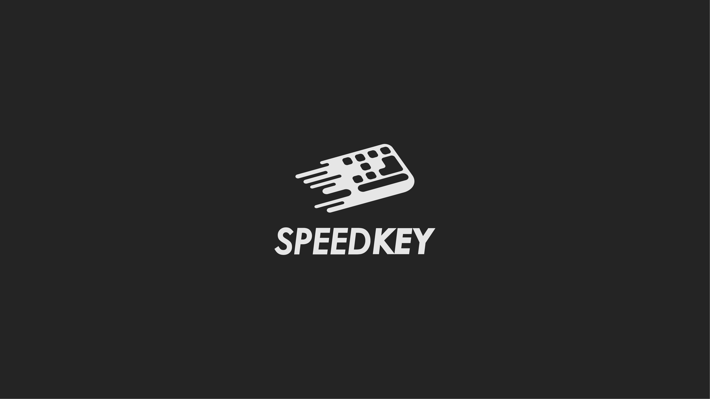
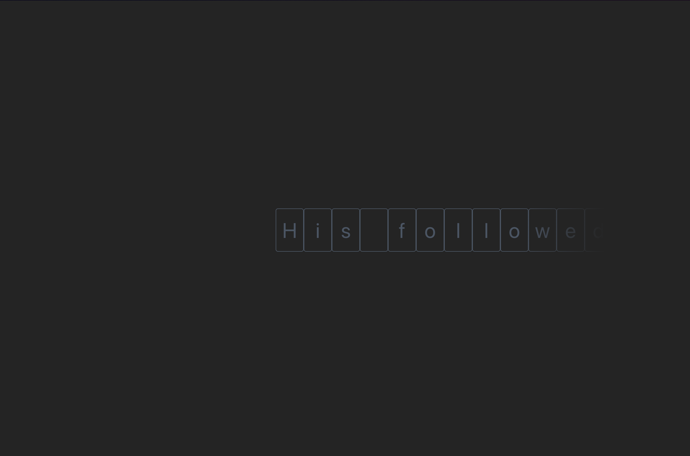
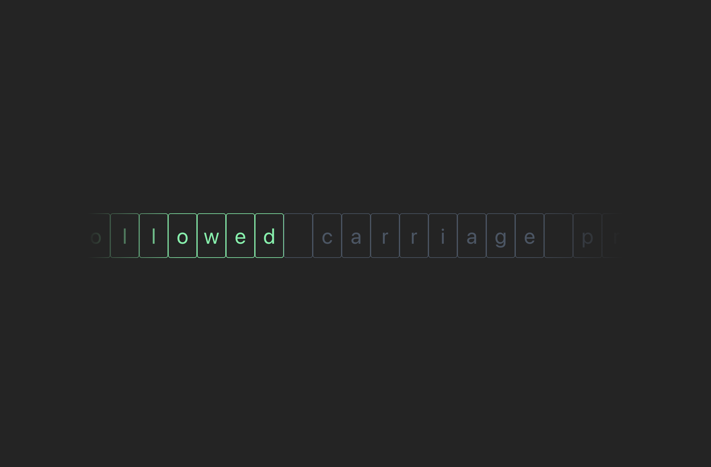
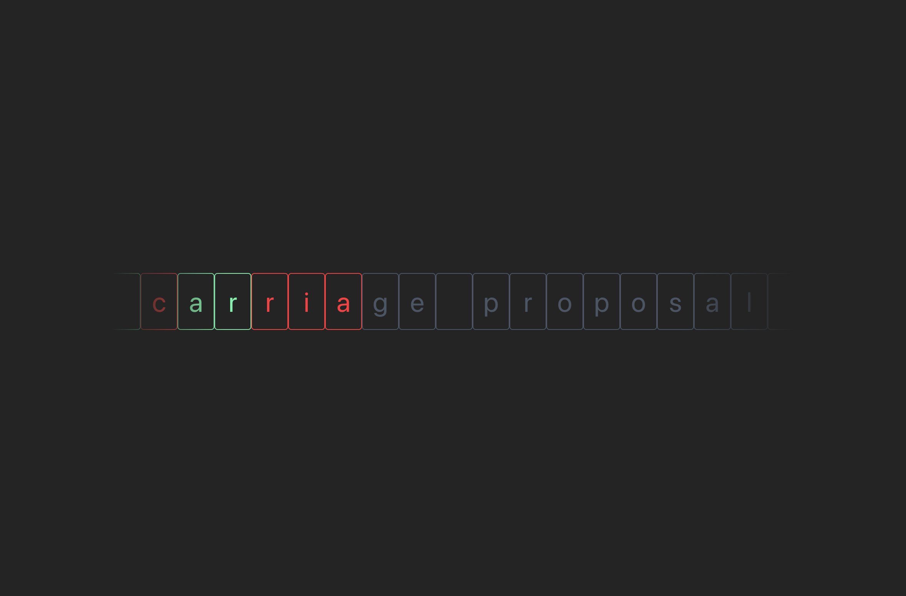

# SpeedKey

It is an interactive typing game designed to improve the user's typing skills through an attractive graphical interface and immersive gameplay logic.

## Running the project
```bash
npm install
```

```bash
npm run dev
```


## Screenshots





## TODO
- [ ] Implement an API integration to fetch random texts dynamically for the typing game.
- [ ] Develop an algorithm for calculating scores based on typing speed and accuracy.
- [ ] Add functionality to accumulate and display the player's score after each round.
- [ ] Create a system to detect and validate the end of the game, ensuring proper scoring and the option to restart or exit.

